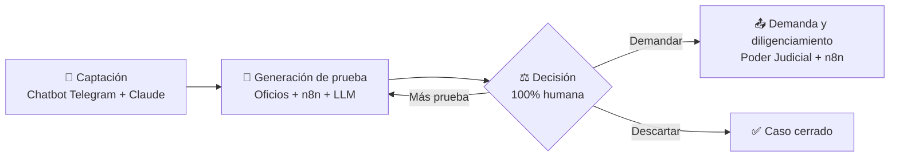

[README(Dev).md](https://github.com/user-attachments/files/29940072/README.Dev.md)
# TP-Final-Diplo-Procesos
Análisis proceso juddicial de un  estudio jurídico desde la captación del cliente a la sentencia.
# ⚖️🤖 LegalOps AI — Automatización Inteligente para Estudios Jurídicos

### De 200 carpetas de papel a un caso, un flujo, un tablero.

[](https://n8n.io)
[](https://core.telegram.org/bots)
[](https://claude.ai)
[](https://sheets.google.com)
[](#)
[](#)
[](#-licencia)

---

## 🚀 Qué es esto

Un estudio jurídico especializado en accidentes de tránsito recibe cada caso por Telegram, arma una carpeta de papel a mano (a veces directamente una fotocopia) y persigue oficios, respuestas y plazos por email y memoria humana. Hoy son ~200 carpetas físicas. Mañana, con el mismo criterio profesional del abogado pero sin la fricción operativa.

**LegalOps AI** es el rediseño de ese proceso con **n8n + un chatbot conversacional en Telegram (impulsado por Claude Sonnet 5) + un tablero central en Google Sheets**, pensado para que el estudio capture, tramite y siga cada caso de punta a punta sin perder ni un oficio en el camino — y sin tocarle un pelo a la decisión legal, que sigue siendo 100% del abogado.

> 📄 ¿Querés el detalle etapa por etapa, con el proceso actual vs. el rediseñado? Está todo en [`docs/proceso-rediseñado.md`](docs/proceso-rediseñado.md).

---

## ✨ Qué resuelve

| Antes 😩 | Después 🚀 |
|---|---|
| Planilla en papel (a veces fotocopiada) + carpeta física por cliente | Chatbot conversacional en Telegram que captura y valida los datos en el momento |
| Filtro de interés del caso a criterio de un humano senior, sin registro estructurado | Mismo criterio humano, pero apoyado en los datos ya estructurados del "Rx del hecho" |
| Oficios redactados y enviados a mano, uno por uno | n8n genera y envía los oficios colegiados por plantilla |
| Seguimiento "a ojo" de quién respondió y quién no | Temporizadores automáticos + tablero de estados en vivo |
| Carpetas compartidas en un servidor local, sin ID de caso | Base central en Google Sheets con nomenclatura estándar por caso |
| Plazos procesales en un Word aparte | Alertas de vencimiento en el mismo tablero central |
| Decisión del abogado sobre una carpeta de papel | Decisión del abogado sobre un dashboard en Sheets con toda la prueba reunida |

---

## 🧠 Cómo funciona



Cuatro etapas, un solo hilo conductor: **los datos nacen digitales y viajan solos entre etapas.** El detalle completo de cada paso, con las herramientas usadas en cada una, está en la [documentación técnica](docs/proceso-rediseñado.md).

---

## 🛠️ Stack tecnológico

| Componente | Herramienta |
|---|---|
| Orquestación de flujos | [n8n](https://n8n.io) (Cloud / self-hosted) |
| Chatbot / LLM conversacional | Bot de Telegram + Claude Sonnet 5 (mismo stack del bot legal existente) |
| Base de datos central / tablero | Google Sheets |
| Canal de captación | Telegram |
| Comunicación con instituciones | Email (IMAP/SMTP), o Gmail (App Password / OAuth2) como alternativa |
| Carga de demandas | Portal web del Poder Judicial |
| Redacción de reiteraciones | LLM sobre el modelo judicial vigente |

---

## 📦 Estructura del repositorio

```
├── README.md
├── docs/
│   └── proceso-rediseñado.md      # Detalle completo: proceso actual vs. rediseñado, etapa por etapa
├── workflows/
│   ├── captacion-chatbot-telegram.json   # Etapa A — captación y validación de datos
│   ├── generacion-prueba.json            # Etapa B — envío y seguimiento de oficios colegiados
│   └── diligenciamiento.json              # Etapa D — oficios judiciales y plazos procesales
└── .env.example                   # Variables de entorno necesarias
```

---

## ⚙️ Instalación y puesta en marcha

### Requisitos previos
- Cuenta de **n8n** (Cloud o instancia self-hosted)
- Un **bot de Telegram** creado vía [@BotFather](https://core.telegram.org/bots#botfather) y su token
- Acceso a la **API de Claude (Anthropic)** con API key
- Una **planilla de Google Sheets** compartida con la cuenta de servicio que use n8n
- Credenciales **IMAP/SMTP** de la casilla del estudio — o, como alternativa, una cuenta de **Gmail** (con App Password u OAuth2)

### Pasos

1. **Cloná el repositorio**
   ```bash
   git clone https://github.com/<tu-usuario>/legalops-ai.git
   cd legalops-ai
   ```

2. **Configurá las variables de entorno**
   ```bash
   cp .env.example .env
   # completá TELEGRAM_BOT_TOKEN, ANTHROPIC_API_KEY, GOOGLE_SHEETS_ID, y
   # SMTP_HOST/IMAP_HOST (casilla propia) o GMAIL_USER/GMAIL_APP_PASSWORD (Gmail) según el caso
   ```

3. **Importá los workflows en n8n**
   En n8n: `Workflows → Import from File` y seleccioná cada archivo de la carpeta `workflows/`.

4. **Conectá las credenciales dentro de n8n**
   Asociá cada credencial (Telegram, Anthropic, Google Sheets, SMTP/IMAP) a los nodos correspondientes de cada workflow importado.

5. **Preparalá la planilla central de Google Sheets**
   Creá las hojas de casos, oficios y plazos procesales, y actualizá los IDs correspondientes en los nodos de Sheets de cada workflow.

6. **Activá los workflows**
   Activá primero `captacion-chatbot-telegram`, luego `generacion-prueba` y por último `diligenciamiento`.

---

## 📊 Impacto esperado

- 🗂️ De ~200 carpetas físicas → **un caso, una carpeta digital, un tablero**
- ⏱️ De reclamos manuales → **recordatorios y reiteraciones automáticas**
- 📍 De carpetas compartidas + Word de plazos aparte → **un solo tablero de estado centralizado en Sheets**
- 👨‍⚖️ La decisión legal sigue siendo humana: la IA hace la carga, la espera y el seguimiento — no el criterio profesional

📄 Métricas y detalle completo en [`docs/proceso-rediseñado.md`](docs/proceso-rediseñado.md).

---

## 👤 Autor

**Elio Sanhueza**
Mente Tecno Lógica — Consultoría en IA y automatización para PyMEs (Mendoza, Argentina)
Diplomatura en IA Aplicada a Entornos de Gestión Digital — FCE-UBA, Cohorte 2026

---

## 📄 Licencia

Este trabajo fue desarrollado con fines académicos como Trabajo Final de la Diplomatura FCE-UBA. Su reutilización o adaptación para otros estudios jurídicos requiere autorización del autor.
